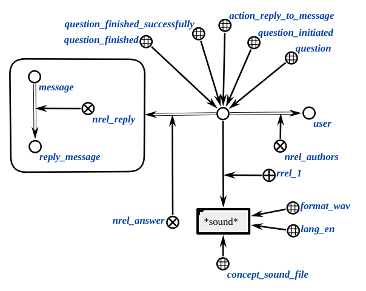

Is an agent that generates the response message, associates with the original relation "nrel_reply"

**Action class:**

`action_reply_to_message`

**Parameters:**

1. `sound or text file`
2. `author` of the message.

**Workflow:**

* The agent generates a message node in the knowledge base, identifying the author of the action as the author of the message and the received sound/text file as the sound/text of that message;
* Then the necessary construction is generated to call the agent of non-atomic action interpretation. An example of this construction is shown below.

</img>

* The agent waits until the interpretation agent finishes its work. Then searches for the response message that should have been generated during the interpretation agent's work and adds it to the response.

### Example

Example of an input structure:

</img>

Example of an output structure:

</img>

### Result

Possible result codes:
 
* `sc_result_ok` - answer message generated;
* `sc_result_error`- internal error.
