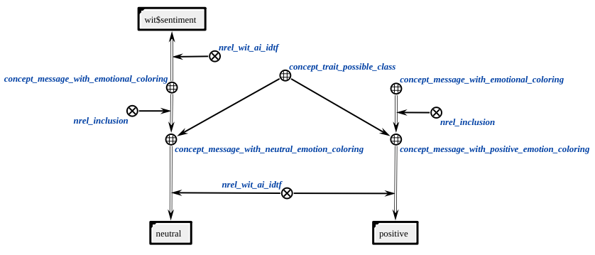
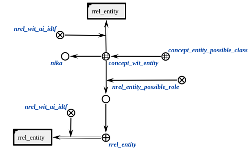

This is an agent that performs the message classification by topic (greeting, about lab work condition, about entity etc.).
Also, the agent classifies message by trait (neutral, positive, negative emotional coloring) and gets message entities.
The agent classifies a message using Wit.ai.

**Action class:**

`action_message_topic_classification`

**Parameters:**

1. `message node` - an element of `concept_message`;

**Libraries used:**

* [Wit.ai](https://wit.ai/) - to classify message and get entities.

**Comment:**

* The input message must contain a text file with the text in Russian;
* The excluding entity should be formalized in knowledge base.

### Examples

Examples of an input structure:

</img>

Examples of an output structure:

</img>

Example of a structure needed to classify message by intent:

</img>

Example of a structure needed to classify message by trait:

</img>

Example of a structure needed to get message entity:

</img>

**Message classes:**

1. `concept_greeting_message`
2. `concept_message_about_entity`
3. `concept_message_about_lab_work_condition`
4. `concept_message_about_lab_work_deadline`

### Agent implementation language
C++

### Result

Possible result codes:

* `SC_RESULT_OK` - the message is successfully classified (or there is empty classification) or the action doesn't belong to the action_message_topic_classification.
* `SC_RESULT_ERROR`- internal error.
